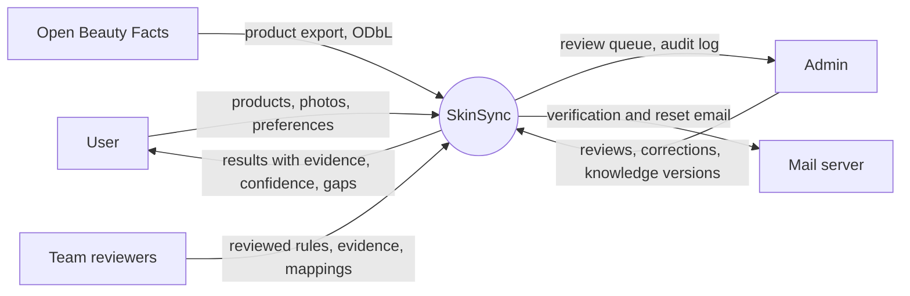
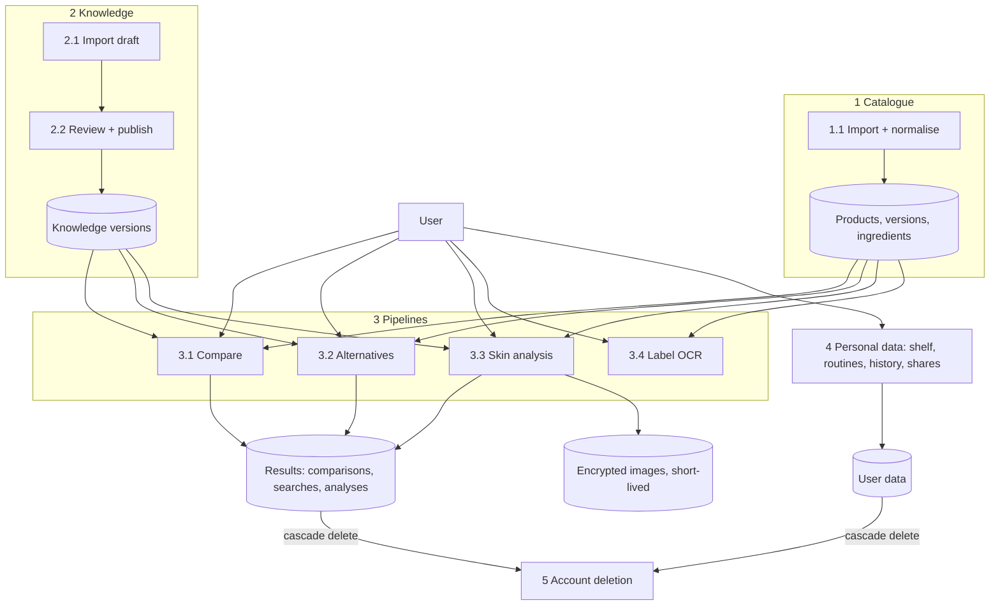

# Data-flow diagrams

## Level 0 (context)

```mermaid
flowchart LR
  U[User] -->|products, photos, preferences| S((SkinSync))
  S -->|results with evidence, confidence, gaps| U
  A[Admin] -->|reviews, corrections, knowledge versions| S
  S -->|review queue, audit log| A
  OBF[Open Beauty Facts] -->|product export, ODbL| S
  T[Team reviewers] -->|reviewed rules, evidence, mappings| S
  S -->|verification and reset email| M[Mail server]
```

## Level 1

```mermaid
flowchart TB
  subgraph P1[1 Catalogue]
    I1[1.1 Import + normalise] --> D1[(Products, versions, ingredients)]
  end
  subgraph P2[2 Knowledge]
    K1[2.1 Import draft] --> K2[2.2 Review + publish] --> D2[(Knowledge versions)]
  end
  subgraph P3[3 Pipelines]
    C[3.1 Compare] & AL[3.2 Alternatives] & SK[3.3 Skin analysis] & OC[3.4 Label OCR]
  end
  D1 --> C & AL & SK & OC
  D2 --> C & AL & SK
  C & AL & SK --> D3[(Results: comparisons, searches, analyses)]
  U[User] --> C & AL & SK & OC
  U --> PS[4 Personal data: shelf, routines, history, shares] --> D4[(User data)]
  SK --> D5[(Encrypted images, short-lived)]
  D3 & D4 -->|cascade delete| DEL[5 Account deletion]
```
