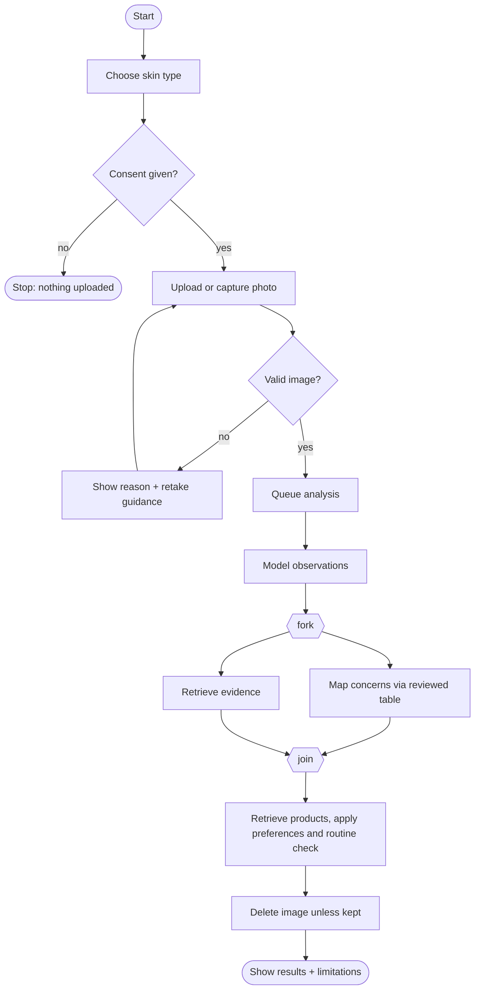

# Activity: skin analysis (spec §7)

```mermaid
flowchart TD
  S([Start]) --> T[Choose skin type]
  T --> C{Consent given?}
  C -- no --> X([Stop: nothing uploaded])
  C -- yes --> U[Upload or capture photo]
  U --> V{Valid image?}
  V -- no --> E[Show reason + retake guidance] --> U
  V -- yes --> Q[Queue analysis]
  Q --> M[Model observations]
  M --> F{{fork}}
  F --> CM[Map concerns via reviewed table]
  F --> EV[Retrieve evidence]
  CM --> J{{join}}
  EV --> J
  J --> P[Retrieve products, apply preferences and routine check]
  P --> D[Delete image unless kept]
  D --> R([Show results + limitations])
```
