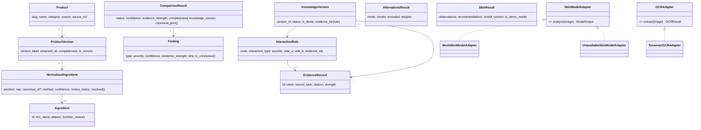

# Domain classes (simplified)

```mermaid
classDiagram
  class Product { slug; name; category; source; source_ref }
  class ProductVersion { version_label; observed_at; completeness; is_current }
  class NormalizedIngredient { position; raw; canonical_id?; method; confidence; review_status; resolved() }
  class Ingredient { id; inci_name; aliases; function_classes }
  class KnowledgeVersion { version_id; status; is_demo; evidence_for(rule) }
  class InteractionRule { code; interaction_type; severity; side_a; side_b; evidence_ids }
  class EvidenceRecord { id; claim; source_type; citation; strength }
  class Finding { type; severity; confidence; evidence_strength; why; is_conclusive() }
  class ComparisonResult { status; confidence; evidence_strength; completeness; knowledge_version; canonical_json() }
  class AlternativesResult { mode; results; excluded; weights }
  class SkinResult { observations; recommendations; model_version; is_demo_model }
  class SkinModelAdapter { <<interface>> analyze(image) ModelOutput }
  class OCRAdapter { <<interface>> extract(image) OCRResult }
  Product "1" --> "*" ProductVersion
  ProductVersion "1" --> "*" NormalizedIngredient
  NormalizedIngredient "*" --> "0..1" Ingredient
  KnowledgeVersion "1" --> "*" InteractionRule
  KnowledgeVersion "1" --> "*" EvidenceRecord
  InteractionRule "*" --> "1..*" EvidenceRecord
  ComparisonResult "1" --> "*" Finding
  SkinModelAdapter <|.. MockSkinModelAdapter
  SkinModelAdapter <|.. UnavailableSkinModelAdapter
  OCRAdapter <|.. TesseractOCRAdapter
```
