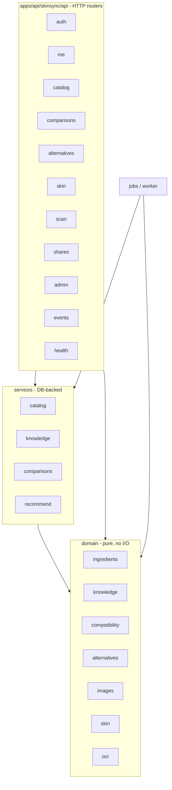

# Components

See `../architecture.md` for the deployment-level component diagram. Internal API layering:

```mermaid
flowchart TB
  subgraph api[apps/api/skinsync/api  - HTTP routers]
    auth & me & catalog_api[catalog] & comparisons_api[comparisons] & alternatives_api[alternatives] & skin & scan & shares & admin & events & health
  end
  subgraph services[services - DB-backed]
    catalog_s[catalog] & knowledge_s[knowledge] & comparisons_s[comparisons] & recommend
  end
  subgraph domain[domain - pure, no I/O]
    ingredients & knowledge_d[knowledge] & compatibility & alternatives_d[alternatives] & images & skin_d[skin] & ocr
  end
  api --> services --> domain
  api --> domain
  jobs[jobs / worker] --> services & domain
```
