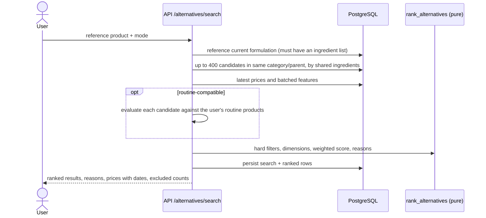

# Sequence: alternatives (UC03, SC-03)

```mermaid
sequenceDiagram
  actor U as User
  participant A as API /alternatives/search
  participant D as PostgreSQL
  participant R as rank_alternatives (pure)
  U->>A: reference product + mode
  A->>D: reference current formulation (must have an ingredient list)
  A->>D: up to 400 candidates in same category/parent, by shared ingredients
  A->>D: latest prices and batched features
  opt routine-compatible
    A->>A: evaluate each candidate against the user's routine products
  end
  A->>R: hard filters, dimensions, weighted score, reasons
  A->>D: persist search + ranked rows
  A-->>U: ranked results, reasons, prices with dates, excluded counts
```
