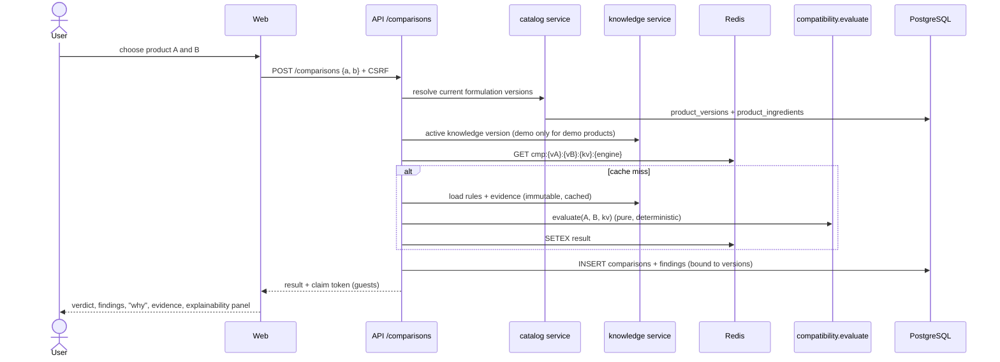

# Sequence: compare two products (UC02, SC-01)

```mermaid
sequenceDiagram
  actor U as User
  participant W as Web
  participant A as API /comparisons
  participant C as catalog service
  participant K as knowledge service
  participant R as Redis
  participant E as compatibility.evaluate
  participant D as PostgreSQL
  U->>W: choose product A and B
  W->>A: POST /comparisons {a, b} + CSRF
  A->>C: resolve current formulation versions
  C->>D: product_versions + product_ingredients
  A->>K: active knowledge version (demo only for demo products)
  A->>R: GET cmp:{vA}:{vB}:{kv}:{engine}
  alt cache miss
    A->>K: load rules + evidence (immutable, cached)
    A->>E: evaluate(A, B, kv)  (pure, deterministic)
    A->>R: SETEX result
  end
  A->>D: INSERT comparisons + findings (bound to versions)
  A-->>W: result + claim token (guests)
  W-->>U: verdict, findings, "why", evidence, explainability panel
```
