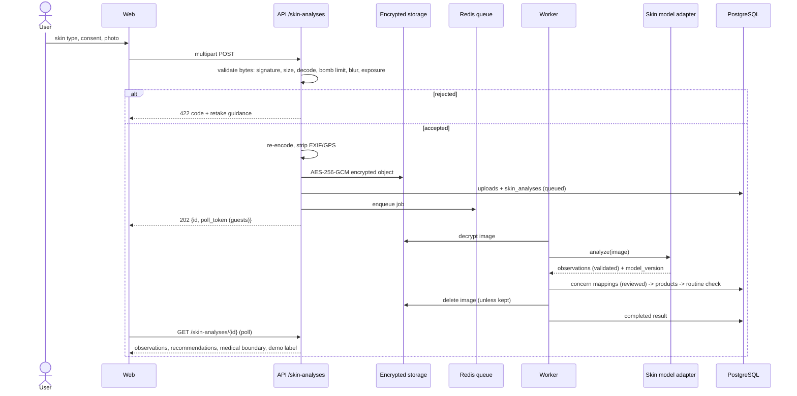

# Sequence: skin analysis (UC01, SC-02)

```mermaid
sequenceDiagram
  actor U as User
  participant W as Web
  participant A as API /skin-analyses
  participant S as Encrypted storage
  participant Q as Redis queue
  participant J as Worker
  participant M as Skin model adapter
  participant D as PostgreSQL
  U->>W: skin type, consent, photo
  W->>A: multipart POST
  A->>A: validate bytes: signature, size, decode, bomb limit, blur, exposure
  alt rejected
    A-->>W: 422 code + retake guidance
  else accepted
    A->>A: re-encode, strip EXIF/GPS
    A->>S: AES-256-GCM encrypted object
    A->>D: uploads + skin_analyses (queued)
    A->>Q: enqueue job
    A-->>W: 202 {id, poll_token (guests)}
    J->>S: decrypt image
    J->>M: analyze(image)
    M-->>J: observations (validated) + model_version
    J->>D: concern mappings (reviewed) -> products -> routine check
    J->>S: delete image (unless kept)
    J->>D: completed result
    W->>A: GET /skin-analyses/{id} (poll)
    A-->>W: observations, recommendations, medical boundary, demo label
  end
```
