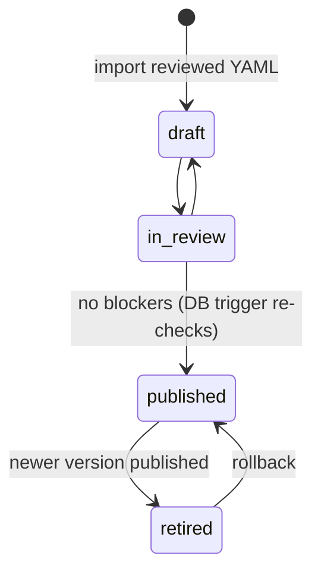
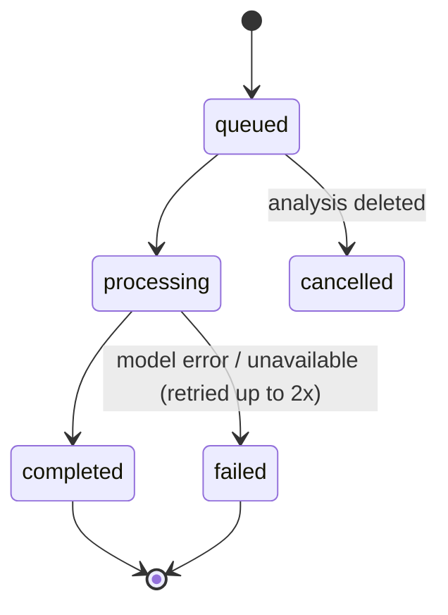

# State machines

## Knowledge version

```mermaid
stateDiagram-v2
  [*] --> draft: import reviewed YAML
  draft --> in_review
  in_review --> draft
  in_review --> published: no blockers (DB trigger re-checks)
  published --> retired: newer version published
  retired --> published: rollback
```

## Background job / skin analysis

```mermaid
stateDiagram-v2
  [*] --> queued
  queued --> processing
  processing --> completed
  processing --> failed: model error / unavailable (retried up to 2x)
  queued --> cancelled: analysis deleted
  completed --> [*]
  failed --> [*]
```
