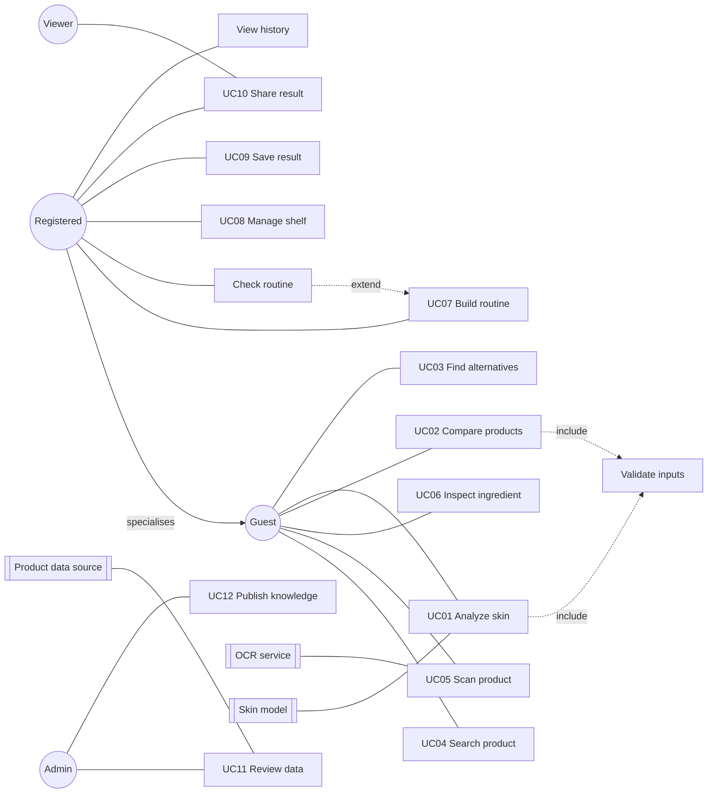

# Use cases

```mermaid
flowchart LR
  G((Guest)) --- UC04[UC04 Search product]
  G --- UC05[UC05 Scan product]
  G --- UC06[UC06 Inspect ingredient]
  G --- UC02[UC02 Compare products]
  G --- UC01[UC01 Analyze skin]
  G --- UC03[UC03 Find alternatives]
  R((Registered)) -->|specialises| G
  R --- UC07[UC07 Build routine]
  R --- CR[Check routine]
  R --- UC08[UC08 Manage shelf]
  R --- UC09[UC09 Save result]
  R --- UC10[UC10 Share result]
  R --- VH[View history]
  V((Viewer)) --- UC10
  A((Admin)) --- UC11[UC11 Review data]
  A --- UC12[UC12 Publish knowledge]
  UC02 -.include.-> VI[Validate inputs]
  UC01 -.include.-> VI
  CR -.extend.-> UC07
  OCR[[OCR service]] --- UC05
  SM[[Skin model]] --- UC01
  PDS[[Product data source]] --- UC11
```
